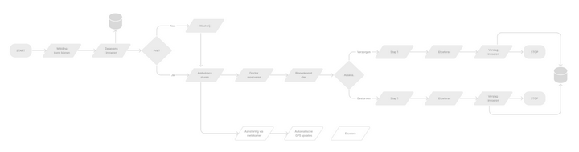
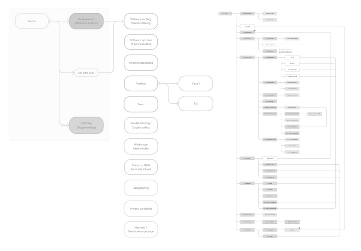
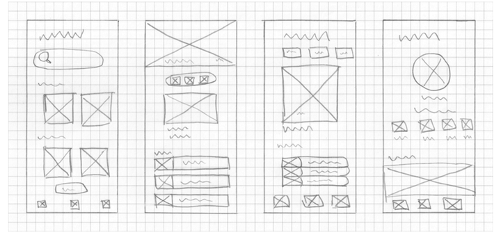
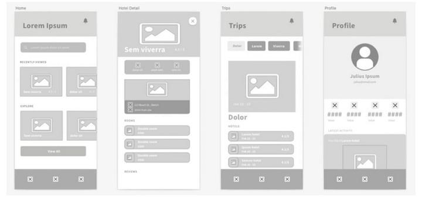
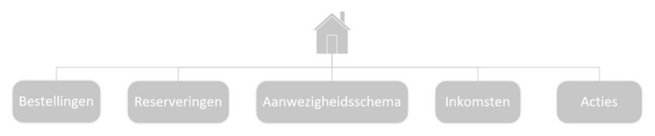
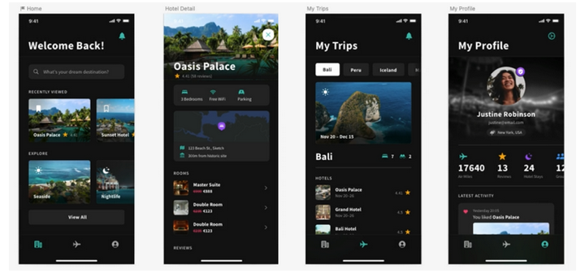

# Functioneel ontwerp `projectnaam`

`Alle backticked teksten dienen als voorbeelden en kan je of verwijderen, of vervangen met je eigen inhoud. Vergeet niet alle backticks te verwijderen! Stel je hebt verwijzingen naar bestanden, broncode, of je wilt tekst accentueren, dan kan je natuurlijk nog steeds backticks gebruiken.`

## Functionaliteiten

`Beschrijf alle functionaliteiten die onderdeel zijn van het te ontwikkelen product.`

## Schema's

`Voeg hier gebruikersscenario’s (use cases), stroomdiagrammen (flowcharts), sitemaps, UML, etc. toe, ter verduidelijking van de functionaliteiten. Beschrijf ook telkens elk schema, zodat leken begrijpen wat men bedoeld.`

### Stroomschema's

`Een stroomschema toont vaak een proces (inclusief beslissingsmomenten) dat men doorloopt. Voeg waar nodig meerdere stroomschema’s toe, die de relevante logica tonen, of verwijs naar externe bronnen.`

### Sitemaps

`Een sitemap toont vaak de structuur van de pagina’s en hoe men daar kan komen. Hieronder een tweetal voorbeelden van een vrij eenvoudige tot redelijk complexe website.`

## Wireframes

`Voeg hier de wireframes, schetsen en/of mockups toe, ter verduidelijking van de user interface. Plaats bij elke weergave ook telkens een beschrijving.`

`Voorbeeld van een laag-getrouwheid (low-fidelity) wireframe`

`Voorbeeld van een medium-getrouwheid (medium-fidelity) wireframe`

## Navigatiestructuur

`Waar nodig kan je hier de navigatiestructuur tonen van het te ontwikkelen product. De processen kan je tonen via een sitemap, stroomschema of klassieke stamboomdiagram. De designer van de applicatie heeft hoogstwaarschijnlijk al sitemaps beschikbaar, omdat deze ook voor het visueel ontwerp nodig zijn.`

## Schermontwerpen

`Beschikt een ontwerper al over de hoog-getrouwheid (high-fidelity) wireframes of mockups, dan kan men deze al toevoegen aan het functioneel ontwerp.`

`In veel gevallen is men nog bezig met het ontwerpen, omdat tegenwoordig ontwerp en ontwikkeling tegelijk op kunnen gaan. In een agile werkmethodiek worden tussendoor ook aanpassingen verricht die weer invloed hebben op delen van de interface.`

`Is er nog geen mockup beschikbaar, dan kan men dit onderwerp schrappen.`

`Voorbeeld van een hoog-getrouwheid (high-fidelity) wireframe of mockup.`

## Datamodel

`Beschrijving van welke gegevens worden opgeslagen en waarnaar kan worden gelezen/geschreven. Het type opslag is op dit moment niet relevant. Dit staat vermeld in het TO.`

## Opmerkingen

`Zijn er nog opmerkingen, dan kan je deze in dit hoofdstuk kwijt.`

## Bijlagen

### Verklarende woordenlijst

Enkel de termen die genoemd worden binnen dit document.

| Terminologie | Omschrijving |
| :--- | :--- |
| `Term` | `Uitleg` |
| `Term` | `Uitleg` |
| `etc` | `etc` |

### Overige

`Voeg hier eventuele overige bijlagen toe die relevant zijn.`
