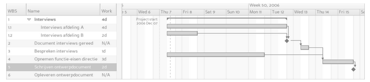

# Projectplan `projectnaam`

Algemene informatie over het project.

`Alle backticked teksten dienen als voorbeelden en kan je of verwijderen, of vervangen met je eigen inhoud. Vergeet niet alle backticks te verwijderen! Stel je hebt verwijzingen naar bestanden, broncode, of je wilt tekst accentueren, dan kan je natuurlijk nog steeds backticks gebruiken.`

## Projectdetails

| Info | Toelichting |
| :--- | :--- |
| Projectnaam   | `Geef de projectnaam op. Deze staat ook in de titel van het document.` |
| Opdrachtgever | `Geef de bedrijfsnaam van de klant op.` |
| Projectnummer | `Geef (i.v.t.) een projectnummer op.` |
| Auteur        | `Geef de auteursnaam op.` |
| Datum         | `Geef de datum op wanneer het document is opgesteld.` |
| Versie        | `Geef (i.v.t.) het versienummer op.` |

## Voorwoord

`Beschrijf hier (kort) iets over de opdrachtgever / klant, achtergrondinformatie en het product zelf. Verderop in dit document kun je deze informatie verder uitwerken en toelichten.`

## Inleiding

`Dit wordt een specifieke inleiding die behoort bij het projectplan. Beschrijf hier (kort) wat de lezer van dit document kan verwachten.`

## Probleemstelling

`Hier kun je beschrijven waarom dit project wordt uitgevoerd. Wat is het uiteindelijke doel of waarom wil de ‘klant’ het product dat wordt ontwikkeld (tegen welk probleem liep de ‘klant’ aan)? In sommige gevallen wordt dit ook wel beschreven als een behoefteanalyse (waar heeft de ‘klant’ behoefte aan).`

## Doelstellingen

`Bij doelstellingen kun je denken aan wat er met het project bereikt kan worden. Denk er hierbij bijvoorbeeld aan dat iemand een applicatie ‘krijgt’ die zijn / haar bedrijfsprocessen kan versnellen door dit (deels) te automatiseren.`

## Werkzaamheden

`Dit onderdeel beschrijft voornamelijk wat er gedaan moet worden. Te denken valt aan:`

- `Documentatie maken`
- `Schetsen maken`
- `Product ontwerpen`
- `Ontwikkelen product`
- `Product testen`
- `Posters ontwerpen`
- `Logboek bijhouden`

`Voeg alle voor het project relevante werkzaamheden toe aan deze lijst en beschrijf ieder onderdeel in enig detail, zodat alle partijen weten wat men kan verwachten.`

## Middelen

`Wat heb je nodig om het proces tot een goed einde te brengen? Hoe pak je het aan en volgens welke ontwikkelmethode wordt er gewerkt:`

- `Scrum`
- `Agile`
- `Waterval`
- `Feature Driven`
- `Test Driven`
- `Prince2`

Zie: https://nl.wikipedia.org/wiki/Softwareontwikkelmethode

## Grenzen

`Geef een overzicht van:`

- `Wat we zullen doen`
- `Wat we niet zullen doen (zelfs als dit zou bijdragen aan de doelstellingen van de klant)`

`Omschrijf dan ook netjes waarom je iets wel/niet doet, zodat het duidelijk is waarom daarvoor gekozen is.`

## Vereisten

`Randvoorwaarden, functionele en operationele eisen, alsook ontwerpbeperkingen van het product. Deze kan men toevoegen middels een MoSCoW-schema. Soms noemt men hier ook de SMART methode, maar die gebruiken wij niet super vaak.`

### MoSCoW-schema
In dit schema beschrijven we van ieder onderdeel of het behoort tot een van de volgende vier categorieën:

- Must have: onderdelen die het product **absoluut** moet kunnen
- Should have: onderdelen die niet volledig nodig zijn, maar wel **extreem fijn zijn** om te hebben
- Could have: onderdelen die **leuk zijn** om te hebben, als je daarvoor tijd hebt
- Won’t have: onderdelen die **absoluut niet** gemaakt worden in dit project

Het is overigens mogelijk dat er in het verloop van het project bepaalde onderdelen onderling verschuiven. Een Won’t have wordt soms een Could have… en vice versa. 

`Voorbeelden`

- `Must have:`
  - `Bestellingen van goederen op kunnen nemen`
  - `Reserveringen van het restaurant kunnen toevoegen`
  - `Werknemers schema's wanneer mensen wel/niet werken`
- `Should have:`
  - `Schema hoeveel geld op een avond verdiend is`
- `Could have:`
  - `Een plek waar alle acties staan`
- `Won’t have:`
  - `De software hoeft geen mailtjes te sturen, want dat doet de manager zelf`

`Geef waar nodig ook de reden waarom iets (niet) gedaan wordt, zodat dit voor iedereen duidelijk is.`

### SMART (optioneel)

`Kijk zelf even of je deze wilt toepassen. Anders verwijder dit gewoon dit hele onderwerp.`

## Product

`Wat hebben we als het product af is? Wat doen de onderdelen? Benoem ze en de onderlinge relaties.`

## Kwaliteitsgaranties (optioneel)

`Wat is de kwaliteit van het product en hoe bewerkstelligen we dat? Hoe is dit te meten?`

## Projectorganisatie

`Stakeholders en projectleden. Hun functies, kennis, contactgegevens en verantwoordelijkheden. En hoe communiceert iedereen? Je kunt hier evt ook vermelden welke planningssoftware jullie willen gaan gebruiken.`

## (Ruime) Planning

`Om alles tot een goed einde te brengen is het wenselijk om duidelijk in kaart te brengen wanneer wat wordt gedaan. Bij voorkeur in chronologische volgorde.`

`Heb je daarvoor software beschikbaar, dan kan je onderzoeken of dit mogelijk is via een Gantt-grafiek. Dit is een schematische weergave die toont wanneer welke activiteiten/onderdelen worden gedaan/gemaakt.`

 
_Voorbeeld van een Gantt-grafiek_

`Zie: https://nl.wikipedia.org/wiki/Gantt-grafiek`

`Heb je liever een wat simpeler overzicht, dan kun je dit ook in een tabelvorm gieten. Net zoals bij een Gantt-grafiek is dit op chronologische volgorde. Waar nodig kunnen taken overlappen.`

| Wat zijn de taken? | Wanneer beginnen? | Wanneer klaar? | Wie werkt er aan? |
| :--- | :--- | :--- | :--- |
| `Taak` | `Datum` | `Datum` | `Namen` |
| `Taak` | `Datum` | `Datum` | `Namen` |
| `etc` | `etc` | `etc` | `etc` |

## Kosten en baten (optioneel)

`Tijd en geld indicaties en implicaties, evt. opgedeeld per fase van het project. Wat zijn de voordelen van iedere fase? En hoe bewaken we deze?`

## Risico’s

`Is het haalbaar? Wat kan ons tegenhouden? Hoe kunnen we de risico's verminderen of vermijden? Wie is daarvoor verantwoordelijk?`

- `Wat zal de haalbaarheid van het project beïnvloeden? Bijvoorbeeld:`
  - `Niet genoeg tijd (deadline)`
  - `Niet genoeg kennis`
  - `De projectformulering is ontoereikend en/of onduidelijk`
  - `Niet genoeg (toegang tot) middelen`
- `Met welke tegenmaatregelen kan je deze risico's verkleinen`
- `Wie is verantwoordelijk voor de uitvoering van die maatregel(en)`

## Bijlagen

### Standaarden en/of procedures

`Beschikt het bedrijf en/of ontwikkelteam over vooraf vastgelegde ‘standaarden’ of ‘procedures’, dan kan men deze als bijlage vermelden. Waar nodig kan men verwijzen naar externe documentatie, mits deze ook beschikbaar gesteld kan worden aan een klant.`

### Definition of Done (optioneel)

`In Agile (o.a. Scrum) gebruiken we een Definition of Done, om te bepalen wanneer iets als afgerond kan worden aangemerkt. Dit bepaalt het ontwikkelteam per project. Waar nodig kan men deze DoD hier in dit projectplan vermelden, zodat alle partijen weten waar het ontwikkelteam zich aan dient te houden.`

### Verklarende woordenlijst

Enkel de termen die genoemd worden binnen dit document.

| Terminologie | Omschrijving |
| :--- | :--- |
| `Term` | `Uitleg` |
| `Term` | `Uitleg` |
| `etc` | `etc` |

### Overige

`Voeg hier eventuele overige bijlagen toe die relevant zijn.`
