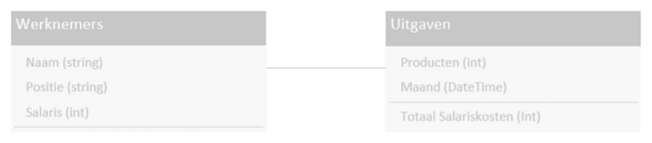
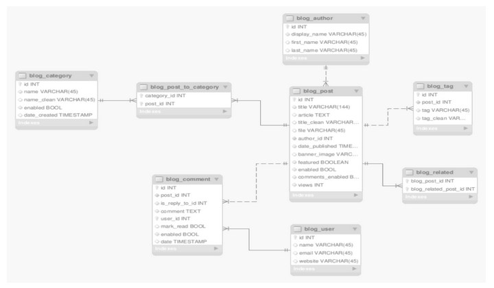

# Technisch ontwerp `projectnaam`

`Alle backticked teksten dienen als voorbeelden en kan je of verwijderen, of vervangen met je eigen inhoud. Vergeet niet alle backticks te verwijderen! Stel je hebt verwijzingen naar bestanden, broncode, of je wilt tekst accentueren, dan kan je natuurlijk nog steeds backticks gebruiken.`

## Technische eisen

`Hoe moet het gaan werken? Snelheid, programmeertalen, IDE. Evt. API en afhankelijkheden vermelden.`

### Client side (front-end)
Opsomming van specifieke client side eisen

- `Voeg een eis toe`
- `Voeg een eis toe`
- `etc`

### Client side (front-end)
Opsomming van specifieke server side eisen

- `Voeg een eis toe`
- `Voeg een eis toe`
- `etc`

## Componenten en modules

- `Geef aan uit welke componenten je systeem zal bestaan en hoe die componenten gaan samenwerken.`
- `Geef aan uit welke modules elke component bestaat, welke benodigde functionaliteiten ze hebben en hoe ze aan elkaar zijn gekoppeld.`
- `Eventuele afhankelijkheden van externe modules die niet standaard zijn.`

## Diagrammen

### Klassendiagram

`Het klassendiagram geeft aan hoe alle gegevens opgeslagen gaan worden in een database en hoe al deze gegevens met elkaar verbonden staan. Hieronder staan een voorbeeld van 2 klassen.`

`Taken:`
- `Teken het klassendiagram van alle klassen, attributen en onderlinge relaties, dat bij je applicaties hoort`
- `Maak een klassen tabel met uitleg over wat een klasse precies doet`

### Activiteitendiagram

- `Teken het activiteitendiagram (flow diagram) dat bij je applicatie hoort`

### Sequentiediagram

- `Teken hoe de verschillende klassen moeten samenwerken.`

## Datamodel

`Hier leg je uit welke keuzes je hebt gemaakt voor elk type data in het klassendiagram en waarom. Doe dit door middel van het hieronder aangegeven schema:`

| Info | Omschrijving | | 
| :--- | :---| :---| 
| Naam entiteit | `Voer gegevens in` | |
| Definitie | `Voer gegevens in` | |
| Attribuutnaam | Datatype | Toelichting |
| `Voer gegevens in` | `Voer gegevens in` | `Voer gegevens in` |
| `etc` | `etc` | `etc` |
| `etc` | `etc` | `etc` |
| Relatie | Toelichting |
| `R1` | `Voer gegevens in` | |
| `R2` | `etc` | |
| `R3` | `etc` | |

- `Zet bovenaan de naam van de uiteindelijke tabel, en in de definitie wat dit precies inhoud.`
- `Zet onder de attribuutnaam hoe het onderdeel heet, in het datatype hoe je het op gaat slaan, en in de toelichting waarom je daarvoor gekozen hebt.`
- `En in het relatie onderdeel zet je neer met welke andere tabellen van de database deze tabel mee te maken gaat hebben, en waarom.`

`Het is voor een ontwikkelaar mogelijk om middels UML een ERD te maken van de te verwachten of reeds gerealiseerde database structuur.`

 
_Voorbeeld van schematisch weergegeven datamodel_

## Beslissingen

`Beschrijf hier kort:`
- `Waarom het op deze manier opgelost gaat worden`

## Afspraken

`Beschrijf hier kort:`
- `Aanleveren materialen of code, door wie en wanneer`
- `Wie wat doet, en wie iets niet doet`

## Grenzen

`Beschrijf hier kort:`
- `Wat er NIET in dit ontwerp zit`
- `Waarom iets er NIET in zit`

## Plan van aanpak

`Beschrijf hier een inleiding van de stappen van de oplossing:`
- `Zorg ervoor dat de Showstoppers in beeld zijn.`
- `Zorg ervoor dat beschreven is dat er een haalbaarheidsonderzoek aan ten grondslag ligt, ofwel, zorg ervoor dat de zaken die de totale haalbaarheid in gevaar brengen EERST getest worden.`

### Haalbaarheid

- `Beschrijf hier in een tabel welke stappen worden genomen in volgorde van afhankelijkheid.`
- `Voorbeeld: eerst testen of er communicatie is tussen PC en apparaat, dan pas complexe communicatieprotocollen ontwerpen.`

## Testplan

- `Geef aan wanneer en hoe je het systeem gaat testen.`
- `Dit betekent dat je dit in detail moet weergeven met test 'invoer' en verwachte 'uitvoer'.`
- `Je dient dit voorgaande het coderen van het systeem al aan te geven.`
- `Aan het einde van de rit dienen de resultaten van het testen in een test rapport te worden vervat en als onderdeel van de documentatie te worden meegeleverd.`

## Bijlagen

### Verklarende woordenlijst

Enkel de termen die genoemd worden binnen dit document.

| Terminologie | Omschrijving |
| :--- | :--- |
| Showstopper | Technisch onderdeel van een ontwerp dat ervoor kan zorgen dat de totale haalbaarheid van het project in gevaar komt. Het is belangrijk dat eerst de showstoppers geïdentificeerd en getest worden. Voorbeeld: als een apparaat bestuurd moet worden vanuit een PC maar de communicatie werkt niet tussen PC en apparaat, zal het dus nooit vanuit een PC bestuurd kunnen worden. Oplossing: eerst dit testen, dan pas naar de volgende stap. |
| `Term` | `Geef diens omschrijving` |
| `Term` | `Geef diens omschrijving` |
| `etc` | `etc` |

### Overige

`Voeg hier eventuele overige bijlagen toe die relevant zijn.`
