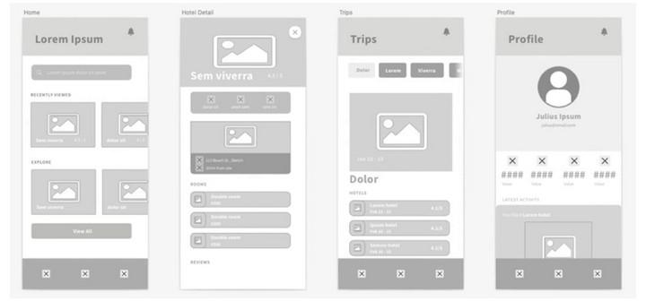
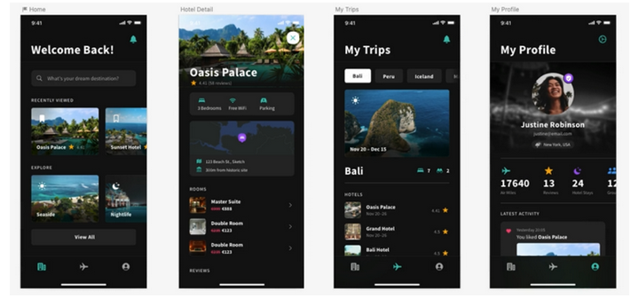

# Visueel ontwerp `projectnaam`

Hoe ziet het digitale product eruit?

`Alle backticked teksten dienen als voorbeelden en kan je of verwijderen, of vervangen met je eigen inhoud. Vergeet niet alle backticks te verwijderen! Stel je hebt verwijzingen naar bestanden, broncode, of je wilt tekst accentueren, dan kan je natuurlijk nog steeds backticks gebruiken.`

## Branding

`Heeft een bedrijf al een eigen huisstijl? Of heb je daar een totaal nieuwe voor ontworpen? Dan is het jouw taak deze correct over te dragen aan de developers, zodat ook zij zich houden aan de branding. Voeg relevante huisstijl informatie toe aan dit document.`

### Logo’s en vereisten

- `Het logo moet altijd voldoen aan de volgende eisen`
  - `Minimaal 20% witruimte rondom het logo`
     
    
  - `Vrijstaand`
  - `Als het bovenop een achtergrond staat, dan moet die afbeelding een laag in een contrastrijk zwart of wit er overheen hebben staan. Bijvoorbeeld;`
    - `Gekleurde foto, met 70% witte laag, met daarop een zwart logo`
    - `Zwart wit foto, met 40% zwarte laag, met daarop een wit logo`
- `Voeg nog een eis toe`
- `etc`

### Huisstijlelementen

- `Kleurgebruik:`
  - `Altijd in de  kleur #4285F4` 
    `Hier mag absoluut niet van worden afgeweken, behalve als het logo;`
    - `In 100% wit (#FFFFFF), of een gradatie daarvan, wordt weergegeven,`
    - `In 100% zwart (#000000), of een gradatie daarvan, wordt weergegeven.`
- `Typografie:`
  - `Fonts = Red Hat Text`
  - `Letter-spacing = 27,7%`
  - `Absoluut GEEN bolds of italics!`
- `Beeldgebruik:`
  - `Afbeeldingen worden te allen tijde onder een 20% zwarte achtergrond weergegeven, behalve als dit anders is aangegeven`
- `Voeg nog een eis toe`
- `etc`

## Framework details

`Gebruik je een framework of design library, dan kan je die hier vermelden, inclusief mogelijke links naar documentatie, hoe men het instelt, of eisen die aan het framework hangen. Bijvoorbeeld;`

- `Wij gebruiken Bootstrap, versie 5.2.3`
- `Wij upgraden NIET naar nieuwere versies (zie TO voor reden).`
- `Documentatie vindt men op https://getbootstrap.com/docs/5.2/getting-started/introduction/` 

## Wireframes

`Plaats hier minimaal medium- of hoog-getrouwheid (fidelity) wireframes. Schetsen zijn té indicatief voor een uiteindelijke ontwerp, en behoren enkel in een FO of TO. Plaats ook telkens een beschrijving.`

 
_Voorbeeld van een medium-getrouwheid (medium-fidelity) wireframe_

`Geef eventueel aan wat hier eisen/wensen zijn bij het realiseren van het ontwerp. Bijvoorbeeld;`

- `Achter iedere afbeelding moet een horizontaal en verticaal gecentreerd load-icoon getoond worden, zodat gebruikers weten dat er op die plek een afbeelding geladen wordt.`
- `Alle afbeeldingen hebben een vaste maatvoering, zowel in hoogte als breedte, zodat de DIV netjes de ruimte inneemt die de afbeelding gaat innemen. Dit zorgt ervoor dat niets onnodig verschuift.`
- `Binnen Hotel Details (zie tweede schermpje hierboven) is opzettelijk een witruimte gecreëerd aan de rechterzijde voor het plaatsen van een inline scroller script, zoals iOS dat doet. Zie TO.`
- `De navigatiebalk aan de onderzijde is een sticky vorm uitgevoerd en staat dus altijd stil`
- `etc`
- `etc`

## Mockups

`Binnen dit onderwerp plaatsen we de hoog-getrouwheid mockups van de applicatie. Hier kan een developer zien wat hij moet gaan ontwikkelen… en kan je (indien van toepassing) uitgebreid beschrijven waar men rekening mee dient te houden.`

 
_Voorbeeld van een hoog-getrouwheid (high-fidelity) wireframe of mockup._

`Geef eventueel aan wat hier eisen/wensen zijn bij het realiseren van het ontwerp. Bijvoorbeeld;`

- `Afbeeldingen hebben altijd een zwart kleurverloop (zie $gradient-photo-details variabele).`
- `Primary color = #38B5AB (mintgroen)`
- `Secondary color = #9454E5 (paars)`
- `LET OP: we geven ‘$clr’-vars NOOIT een naam, maar ENKEL een semantisch omschrijving`
- `etc`
- `etc`

## Assets

`Voeg hier details toe, die relevant zijn voor elk onderdeel.`

### Afbeeldingen

`Geef relevante details`

### Fonts definities

`Geef relevante details`

### Kleurstijlen

`Geef relevante details`

### Variabelen

`Voeg hier relevante informatie toe over alle variabelen die je in het ontwerp hebt gebruikt en die developers zouden moeten gaan verwerken in de applicatieontwikkeling. Bijvoorbeeld;`
- `$clr-primary > De primaire huisstijlkleur`
- `$clr-secondary > Tweede huisstijlkleur.`
- `$gradient-photo-details > Een zwart verloop die altijd aan de onderzijde van iedere detailfoto staat.`
- `LET OP: alle 'clr'-vars zijn tevens verwerkt in calc() functies verderop in SCSS.`
- `etc`

### Vereisten

`Geef relevante details`

### Code-snippets

`Geef relevante details`

## Bijlagen

### Verklarende woordenlijst

Enkel de termen die genoemd worden binnen dit document.

| Terminologie | Omschrijving |
| :--- | :--- |
| `Term` | `Uitleg` |
| `Term` | `Uitleg` |
| `etc` | `etc` |

### Overige

`Voeg hier eventuele overige bijlagen toe die relevant zijn.`
